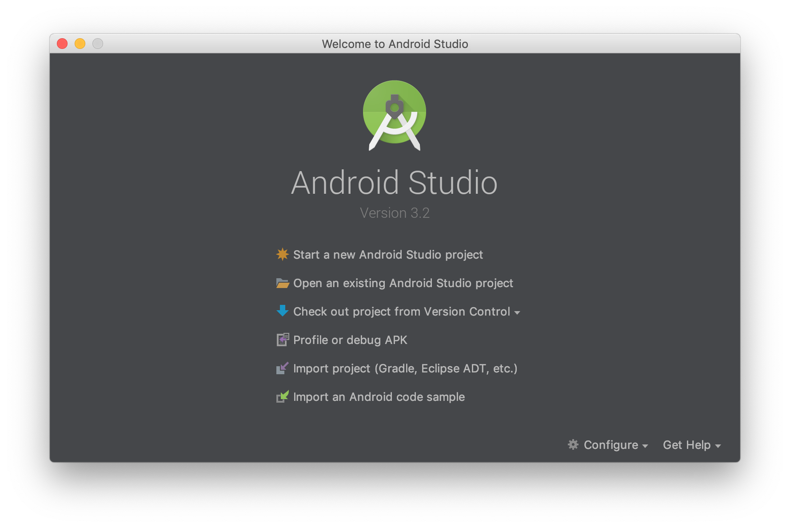
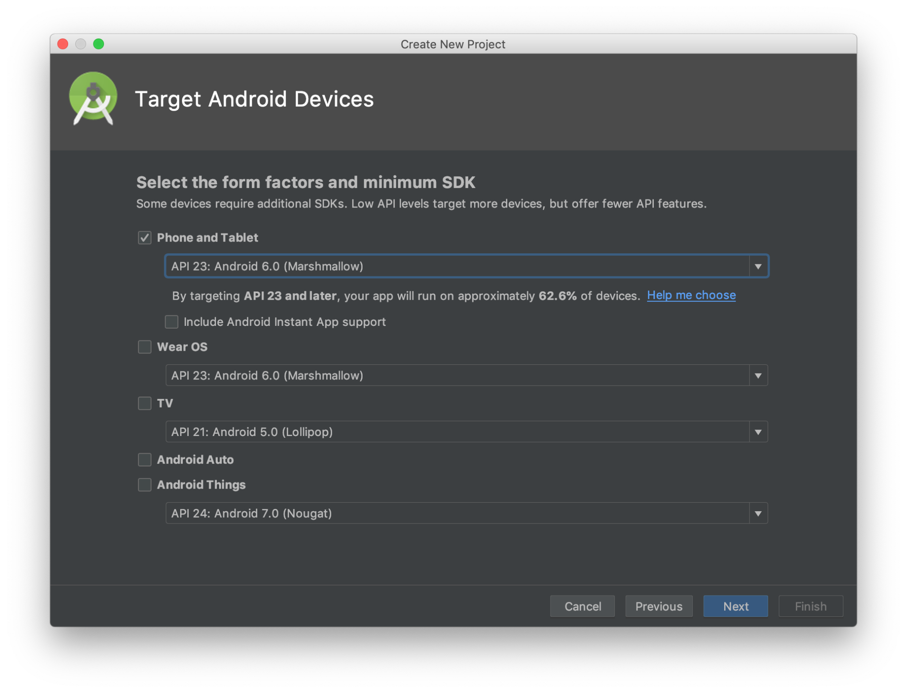
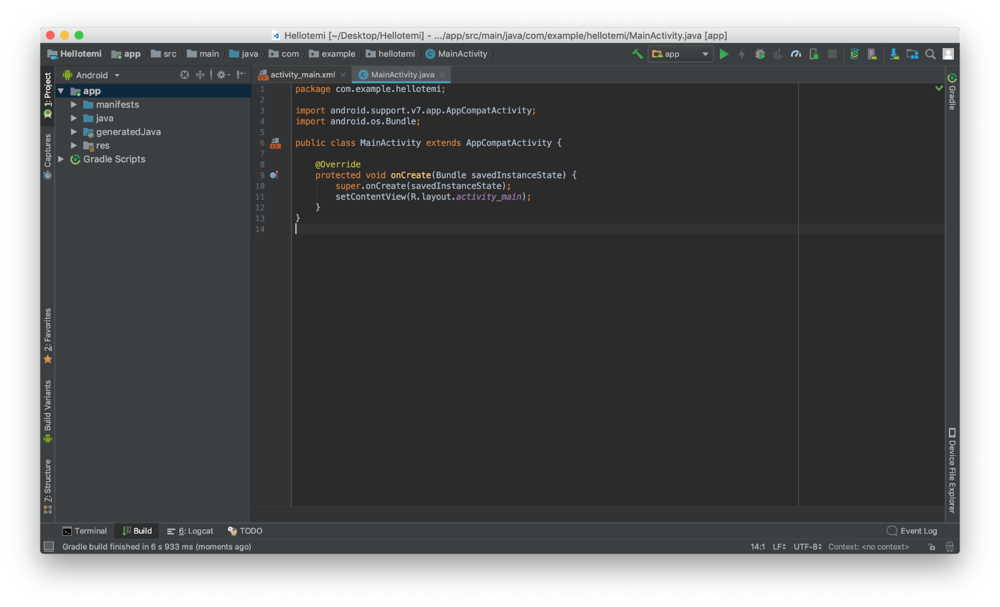

# Create a temi Skill Project

This lesson teaches you how to create a new temi Skill Project.

temi is based on [Android OS](https://en.wikipedia.org/wiki/Android_(operating_system)). Be sure you have installed latest version of Android Studio. You can (download Android Studio here)[https://developer.android.com/studio/].

1. In the **Welcome to Android Studio** window, click **Start a new Android Studio project**.


2. In the **Create Android Project** window, enter the following values:

    * **Application name**: "Hello Temi"
    * **Company domain**: "example.com"

If you want to use Kotlin check the **Include Kotlin support** checkbox. You may also want to change the project location. Click **Next**.

3. In the **Target Android Devices** window, check only **Phone and Tablet** checkbox. In the dropdown menu below it choose “API 23: Android 6.0 (Marshmallow)”. Click **Next**.


4. In the **Add an Activity to Mobile** window, select **Empty Activity** and click **Next**.

5. In the **Configure Activity** screen, keep the default values and click **Finish**. After a while, Android Studio opens the IDE.


6. Open top level `build.gradle` file and add the following maven repository:
```
allprojects {
    repositories {
        ...
        maven {
            url ‘ASK_FOR_READ_URL’
            credentials {
                username ‘ASK_FOR_USERNAME’
                password ‘ASK_FOR_PASSWORD’
            }
        }
    }
}
```

7. Add latest version of temi SDK dependency in your “app” module `build.gradle`:
```
dependencies {
	...
    implementation 'com.robotemi:temi-sdk-usa:0.8.1_beta'
}
```

## Summary
In this lesson you learned how to create a temi Skill Project. We have created basic project using Android Studio and we have added temi SDK as a foundation for building temi Skill.