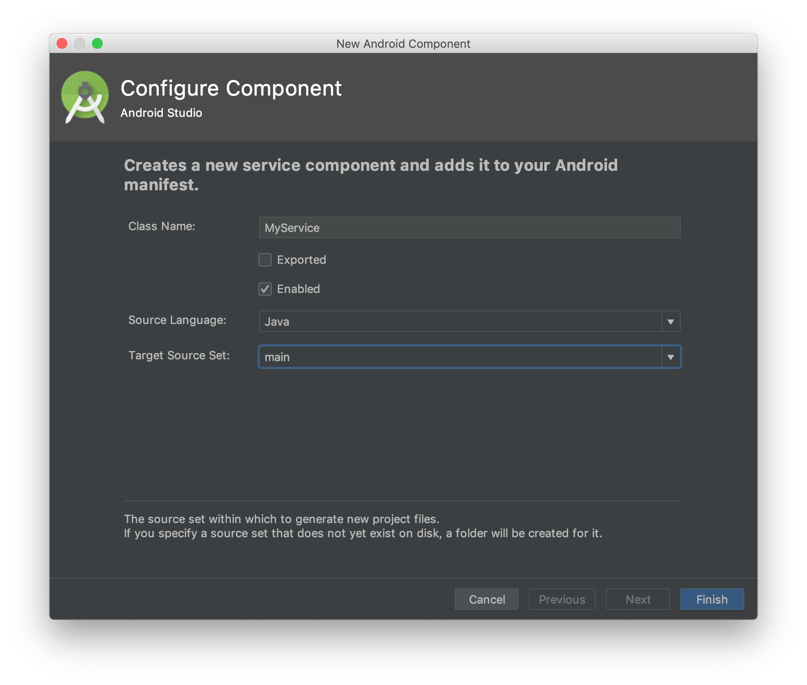
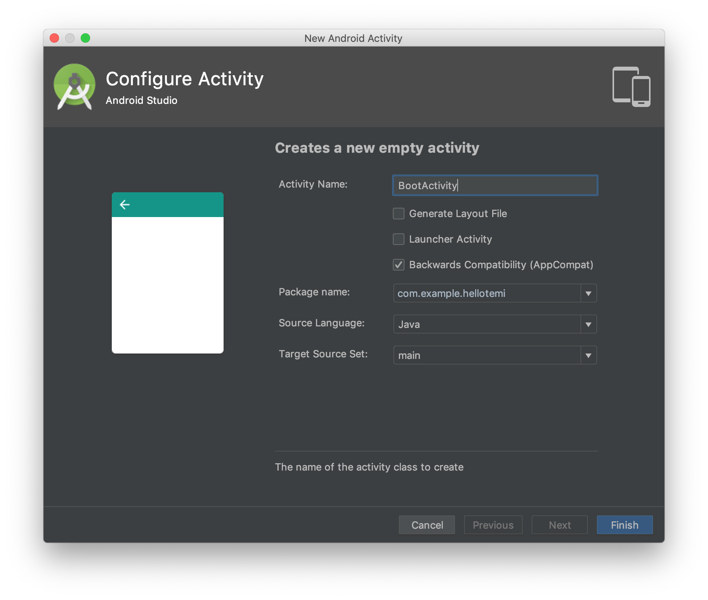
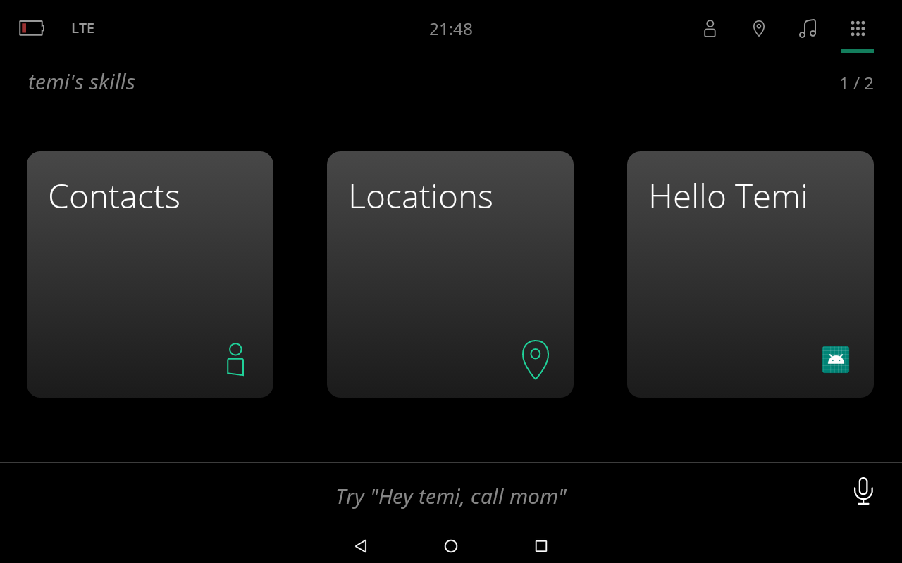

# Configure a temi Skill Project

In the previous lesson we created new temi skill project. This lesson will show you the basic required configuration of created project and describes some key concepts behind temi SDK.

1. In the **Project** window, right-click the **app** folder and select **New -> Service -> Service**.

2. In **Configure Component** window uncheck **Exported** checkbox and click **Finish**.


3. Open newly created **MyService** and make it extend **RoboService** class instead of regular Android **Service** class.

**NOTE**

RoboService is a class from temi SDK. It is responsible for establishing an AIDL service connection between skill and temi. Once connection is established onRobotReady(Robot) callback is notified and main component from the skill is started.

4. Implement abstract method **onRobotReady(Robot)** as shown below:
```
@Override
protected void onRobotReady(Robot robot) {
	Intent intent = new Intent(this, MainActivity.class);
	intent.setFlags(Intent.FLAG_ACTIVITY_NEW_TASK);
	startActivity(intent);
}
```

5. In the **Project** window, right-click the **app** folder and select **New -> Activity -> Empty Activity**.

6. In **Configure Activity** window change **Activity Name** to **BootActivity** (optional), uncheck **Generate Layout File** checkbox and click **Finish**.


7. Open newly created **BootActivity** and make it extend **RoboEntryPointActivity** class instead of regular Android **AppCompatActivity** class.

**NOTE**

RoboEntryPointActivity is a class from temi SDK. Allows temi Launcher to discover skills. Entry point to your skill.

8. Implement abstract method **getMainServiceClassName()** as shown here:
```
@Override
protected Class getMainServiceClassName() {
	return MyService.class;
}
```

9. Open **AndroidManifest.xml** and in **<application>** element add required **<meta-data>** element:
```
<meta-data
	android:name=”com.roboteam.teamy.actions”
	android:value=”hello.temi” />
```

10. In the same file edit **BootActivity <activity>** element as shown below:
```
<activity
	android:name=”.BootActivity”
android:theme=”@android:style/Theme.Translucent.NoTitleBar.Fullscreen">
	<intent-filter>
		<action android:name=”android.intent.action.MAIN” />

		<category android:name=”android.intent.category.LAUNCHER />
		<category android:name=”com.roboteam.teamy.SKILL />
	</intent-filter>
</activity>
```

11. Again in the same **AndroidManifest.xml** file edit default **MainActivity <activity>** element as follows:
```
<activity android:name=”.MainActivity” />
```

## Summary
In this lesson you learned how to configure temi Skill Project. This configuration is required so that your skill can utilize all features offered by temi.

